# Oppsummert

I dette prosjektet har jeg valgt ut en modell som predikerer trafikkmengde over 
Nygårdsbroen på en gitt dato og tidspunkt. Det tar også værdata som input.

Rå vær- og trafikkdata har blitt prosessert slik at det kan brukes til analyse og 
modellering.

Modellen kan brukes på en nettside til å gi et estimat av traffikkmengden på et gitt tidspunkt, 
med eller uten værdata.

# Vasking av data

Vasking av data er hådtert av klassen DataCleaning.
Jeg beskriver den generelle prossesen i rapporten, men i selve
klassen er oppgavene delt opp i flere metoder.

## Trafikkdata

Jeg valgte å fjerne de fleste av kolonnene, ettersom vi bare er interresert i total trafikkmende.
Kolonnene jeg fjernet besto av enten bare tomme verdier, eller en eller to unike verdier som ikke er relevant
for oppgaven.

Noen rader hadde samme tidspunkt, på grunn av tilbakestilling av klokken hvert år i oktober.
Jeg valge å fjerne radene som representerer den tilbakestilte tiden.
Det er snakk om 8 rader som blir fjernet, og som ikke har stor påvirkning på selve datasettet.
For å slippe å ta hensyn til tidsoner, valgte jeg bare å fjerne de.

\newpage

## Værdata

Alle værdata filene blir lest av og slått sammen til et datasett
Alle verdier som var 9999.9 ble gjort om til Nan verdier.
Datasettet er blitt resamplet til 1 times intervaller for å matche trafikkdatasettet.

I kolonnen med globalstråling har jeg satt alle negative verdier til 0.
Realistiske målinger av stråling går ikke under 0, og i henhold til datasettet,
har det nesten ingen påvirkning når de endres. I tillegg satt jeg verdier over 1000
til 1000. Dette gjelder bare et par verdier i Januar 2016, så derfor setter 
jeg disse outliersene til 1000. Jeg satt 1000 som øvrige grense fordi de høyeste verdiene,
utenom outliersene, ligger rundt denne verdien.

Kolonnen med relativ luftfuktighet valgte jeg å fjerne.
Mesteparten av radene har manglende verdier, og vil dermed ha liten nytte sammen med de andre
kolonnene.

## Klargjøring av datasett

Traffikkdata og værdata blir slått sammen til ett dataset.
Fire nye kolonner blir laget for tid, dag, måned og år. 
Da har jeg mer generelle features for modellen, enn dato og tidspunkt som en feature.

# Data analyse

Data analysen er utført på treningsdata, fra 2015 til og med 2020.
Test data fra 2021 og 2022 er ikke brukt i analysen, fordi det kan påvirke 
valgene som blir gjort siden vi kan se hvordan den dataen ser ut på forhånd.

Utforskende datanalyse er implementert i klassen DataExploration.
Selve analysen er gjort i jupyter notebooken DataExploration.

## Statistisk beskrivelse

Flere av kolonnene har manglende verdier. Der har jeg tenkt til å bruke
KNN imputasjon for å håndtere disse.

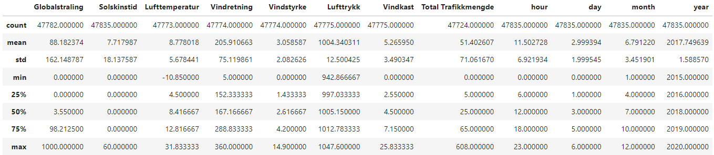

\newpage

## Korrelasjonsmatrise

Utifra korrelasjonsmatrisen ser jeg at det er liten linær korrelasjon 
mellom kolonnene. Unntaket er globalstråling og solskinstid.
Jeg velger derfor å ikke ta i bruk PCA i modelleringen min,
ettersom det er lav linær korrelasjon. Dataen er periodisk og 
avhenger mer av tidspunkt til målingen.

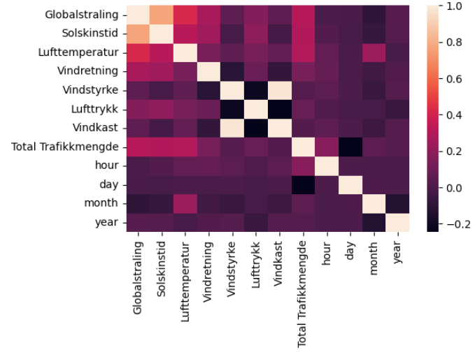

\newpage

## Traffikkmengde på tid

Det er nokså lik traffikmengde for alle årene, med unntak av 2015, som bare
har målinger fra juli. 2019 og 2020 har mest traffikmengde, kan muligens 
forklares av korona pandemien. Jeg velger å ikke bruke år som en feature 
i modelleringen, fordi traffikmengden har liten variasjon fra år til år.

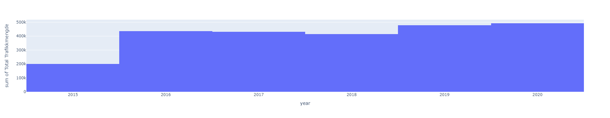

Jeg ser at traffikmengden er høyest i vår og sommer månedene. I juli synker den, 
og øker igjen i august. Jeg tolker dette som at folk drar på ferie i Juli.
Trafikkmenden følger samme mønster for hvert år. 

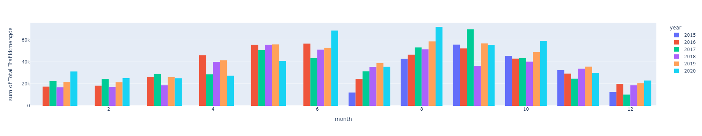

Det er flest som sykler i ukedagene sammenlignet med helgen. Dette er muligens 
fordi folk sykler til og fra jobb. Det stemmer overens med tidspunktet 
det er mest trafikkmende i neste figur.

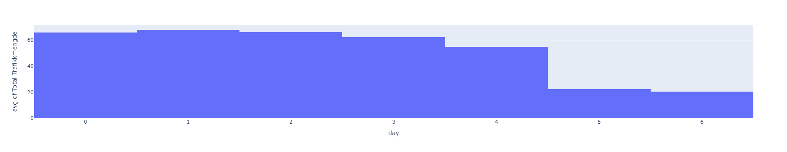

\newpage

Tidspunkt på dagen påvirker traffikmengden betydelig. Rundt kl 8 og 16 
er det mest trafikkmende. Det samsvarer med tidspunktet folk drar til og fra 
jobb/skole.

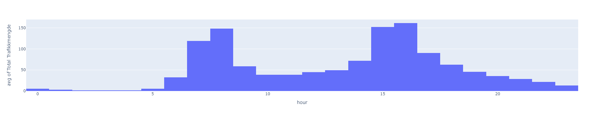

## Temperatur og vindstyrke

Jeg velger også å se på temperatur og vindstyrke sammenlignet med traffikmengde.
At traffikkmengden minker når vindstyrken øker, og at den øker når temperatur øker,
virker intuitivt. Intuisjonen kan virke som den stemmer, men jeg ser også at 
tettheten av datapunkter er mindre i de høye og lave verdiene for vind og temperatur.
Det kan tyde på at det ikke nødvendigvis er en direkte korrelasjon.

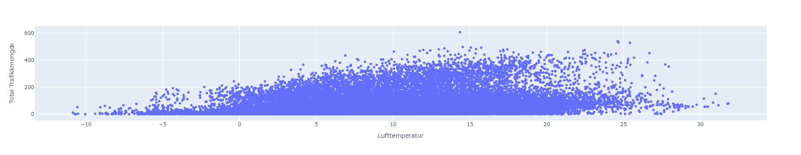

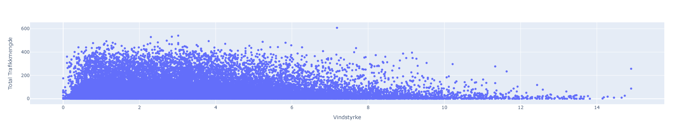

\newpage

# Modellering og resultater

## Modellutvalg

Jeg har valgt ut fire modeller og en baseline.
Baseline modellen bruker gjennomsnittlig traffikkmengde
som prediksjon.

Jeg forventer at RandomForest og neural netverk (MLPR) vil gjøre ganske bra generelt.
MLPR vil nok bruke mye lengre tid på trening, og trenger å testes med flere parameter kombinasjoner
for å få til et bra resultat.

Jeg er usikker på hvor bra SVR kommer til å gjøre det. Parameterene som velges påvirker resultatet 
ganske mye, og jeg har ikke testet så mange. 

ElasticNet vil nok ikke gjøre det så veldig bra siden den er en linær regresjons modell, 
og dataen vi jobber med er periodisk.

- DummyRegressor (baseline)
- Support Vector Regressor (SVR)
- Random Forest Regressor
- Multi Layer Perceptron Regressor (MLPR)
- Elastic Net

Hver modell kjøres gjennom en pipeline, som bruker knn imputasjon med de 5 nærmeste, og 
standardisert skalering på data.

Jeg bruker grid search cross validation for utvalg av beste parameter kombinasjon hos hver modell.
For å ta hensyn til tids basert data, bruker jeg cross validation oppdelt i sekvensielle 
tidsintervaller.

Treningsdata er fra 2015 til og med 2020, og testdata er 2021 og 2022.
Alle random states er satt med seed av 100.

Modellene evalueres etter lavest rmse.

All modellevaluering er implementert i klassen ModelEvaluation.

\newpage

## Validerings resultater

Validerings resultater:[^1]

| Model    | Validation rmse    | Total validation time    |
|---------------- | --------------- | --------------- |
| Dummy         | 70.84     | 1.71s    |
| RandomForest  | 30.13     | 130.36s    |
| MLPR          | 32.48     | 3956.0s   |
| SVR           | 59.31     | 690.72s   |
| ElasticNet    | 65.76     | 5.31s   | 

Vi ser at alle mulige modeller gjør det bedre enn baselinen. Det er derimot bare 
RandomForest og MLPR som har et betydelig bedre resultat.

Resultatene stemte nesten med forventningene mine, men jeg ble litt overrasket av at 
SVR hadde så høy rmse. Den hadde kanskje oppnådd bedre resultat hvis jeg hadde brukt 
flere features eller testet flere parametre.

## Valgte modell

RandomForest Regressor med 250 trær var den modellen som gjorde det best 
på cross validation. Modellen virker til å gjøre det bedre på test data enn 
validering, så den har greid å generalisere til usett data. 

| Model    | Validation rmse    | Test rmse    |
|---------------- | --------------- | --------------- |
| RandomForest    | 30.13    | 25.12    |

[^1]: resultater er hentet fra program_log.txt

Som man ser i de neste figurene, virker det som om modellen oppfatter 
den periodiske svingingen i traffikkmengden. Modellen kan brukes 
til å gi et estimat av traffikkmengden på et gitt tidspunkt, med gitt værdata.

\newpage

### Prediksjon på 2023

På figurene under kan vi se at modellen har klart å lært seg 
traffikkmønsteret nokså godt. Både daglig og timesvis traffikmengde 
i prediksjonen ligner den vi så i data analysen. Månedtlig traffikmengde 
er bare predikert frem til Juni, men den følger også samme mønster som 
i analysen.

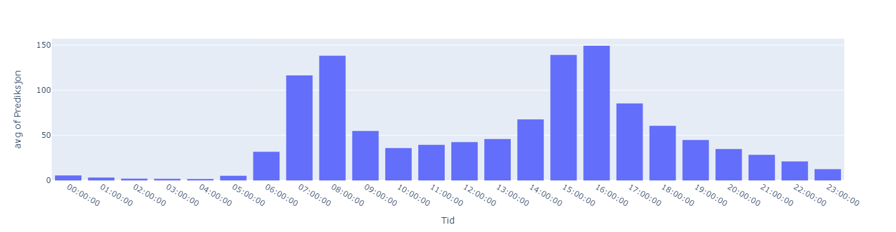

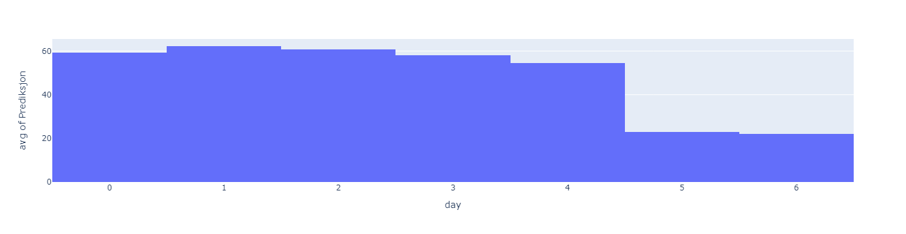

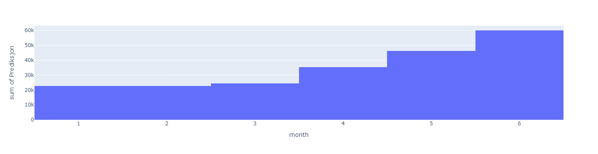

\newpage

## Mulige forbedringer

Å bruke mer tid på å utforske og teste ulike features. Redusere eller lage nye features
for å se om modellen ville fått en lavere rmse.

Jeg kunne gjerne ha testet flere parameter kombinasjoner for å muligens endt opp med en lavere 
rmse.

Jeg ville gjerne ha sett om det er noen spesielle tilfeller 
modellen sliter med. Slik modellen er nå vet jeg ikke 100% om det er et spesielt tilfelle,
eller om det bare er en generell error i modellen.

# Nettside

Jeg har laget en enkel nettside som lar brukeren teste modellen.
Dato og tidspunkt er nødvendig, mens de andre verdiene imputeres dersom de ikke blir oppgitt.

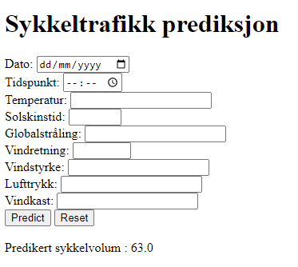

